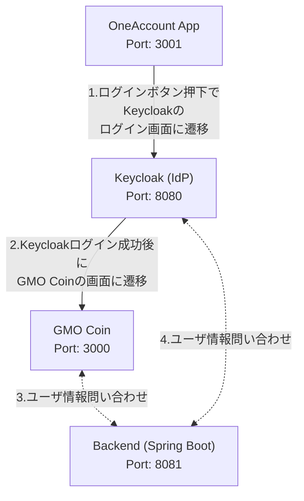

# GoogleAccountLinkageSample

OIDC(OpenID Connect)によるID連携を行うサンプルWebアプリケーション

## 概要

このプロジェクトは、Googleアカウント連携の代替として、Keycloak を使用したOIDC認証のサンプルアプリケーションです。以下の技術スタックを使用し、Docker Composeで一括して起動できます。

- **OneAccountフロントエンド(RP)役 (OneAccount画面の代役):** React + Next.js 14 + Tailwind CSS
- **IDプロバイダー(IdP)役 (OneAccount/GCIPの代役):** Keycloak 24.0.0
- **バックエンド(RP)役 (OneAccountサーバーの代役):** Java + Spring Boot 3 + Gradle 8.5
- **GMOコインフロントエンド(RP)役 (GMOコイン画面の代役):** React + Next.js 14 + Tailwind CSS

最終更新日: 2025年8月15日

## システム構成


## 前提条件

- Docker Desktop がインストールされていること
- ポート 3000, 3001, 8080, 8081 が使用可能であること

## クイックスタート

### 1. リポジトリをクローン

```bash
git clone https://github.com/Masataka-Nakamura-ggs/GoogleAccountLinkageSample.git
cd GoogleAccountLinkageSample
```

### 2. アプリケーションを起動

```bash
docker compose up -d --build
```

初回起動時は、各コンテナのビルドに時間がかかります（5-10分程度）。

### 3. アクセス

以下のURLにアクセスしてください：

- **OneAccountログイン画面:** http://localhost:3001
- **GMOコインログイン画面:** http://localhost:3000
- **Keycloak管理画面:** http://localhost:8080 (admin/admin)
- **バックエンドAPI:** http://localhost:8081/api/health

## 使用方法

### 基本的な認証フロー（GMOコインアプリ）
#### OneAccountアプリ -> Keycloak -> GMOコインの流れを確認

1. http://localhost:3001 にアクセスすると、シンプルなログイン画面が表示されます。
2. 「GMOコインにログイン」ボタンをクリック
3. Keycloakのログイン画面が表示されます
4. 以下の認証情報でログイン：
   - **ユーザー名:** `user01` or `user02`
   - **パスワード:** `password`
5. 認証成功後、仮想GMOコインの画面に遷移します
6. 仮想GMOコインの画面に Keycloakに登録されている `user01` or `user02` の情報が表示されます
   - この時、バックエンドへの問い合わせも自動で行っています

#### GMOコイン -> Keycloak の流れを確認
1. http://localhost:3000 にアクセス
2. 「OneAccountでログイン」ボタンをクリック
3. Keycloakのログイン画面が表示されるので、以下の認証情報でログイン：
   - **ユーザー名:** `user01` or `user02`
   - **パスワード:** `password`
4. 認証成功後、仮想GMOコインの画面にリダイレクトされ、ユーザー情報が表示される
   - この時、バックエンドへの問い合わせも自動で行っています

### テストユーザー

以下のテストユーザーが事前に **KeyCloak** に設定されています：

| ユーザー名 | パスワード | 氏名 | メールアドレス |
|-----------|-----------|------|----------------|
| user01 | password | 山田太郎 | user01@example.com |
| user02 | password | 佐藤花子 | user02@example.com |

## 動作確認ポイント

✅ **フロントエンド認証:** カスタムKeycloak APIによるOIDC認証
✅ **バックエンド認証:** Spring SecurityによるJWT検証  
✅ **API連携:** フロントエンドからバックエンドへのトークン付きリクエスト
✅ **ユーザー情報表示:** IDプロバイダーから取得した情報の表示
✅ **複数フロントエンド:** GMOコインアプリとOneAccountアプリの連携

## UIコンポーネント構成

gmo-coin-appは以下のUIコンポーネントに分割されています：

- **WelcomeCard:** 未認証時のログイン画面
- **UserInfoCard:** 認証済みユーザー情報の表示
- **BackendApiCard:** バックエンドAPIから取得した情報の表示
- **ApiStatusCard:** バックエンドAPIの接続状態表示
- **LoadingSpinner:** データ読み込み中の表示

## トラブルシューティング

### Keycloakが起動しない場合

```bash
# コンテナのログを確認
docker compose logs keycloak

# ポート8080が使用されていないか確認
lsof -i :8080
```

### フロントエンドが起動しない場合

```bash
# GMOコインアプリのログを確認
docker compose logs gmo-coin-app

# OneAccountアプリのログを確認
docker compose logs oneaccount-app

# ポート3000/3001が使用されていないか確認
lsof -i :3000
lsof -i :3001
```

### バックエンドが起動しない場合

```bash
# バックエンドのログを確認
docker compose logs backend-api

# ポート8081が使用されていないか確認
lsof -i :8081
```

### 認証エラーが発生する場合

1. Keycloakが完全に起動しているか確認
2. http://localhost:8080/realms/one-account-realm/.well-known/openid-configuration にアクセスして設定を確認
3. ブラウザのキャッシュをクリア
4. フロントエンドのログを確認: `docker compose logs gmo-coin-app`

### API エンドポイントが呼び出せない場合

```bash
# フロントエンドの認証API確認
curl -I http://localhost:3000/api/keycloak/auth

# バックエンドのヘルスチェック
curl -I http://localhost:8081/api/health

# Keycloakのエンドポイント確認
curl -I http://localhost:8080/realms/one-account-realm/protocol/openid-connect/auth
```

## 停止方法

```bash
# アプリケーションを停止
docker compose down

# ボリュームも含めて削除（データもリセット）
docker compose down -v
```

## 開発モード

個別のサービスを開発モードで起動する場合：

### フロントエンド（開発モード）

```bash
# GMOコインアプリ
cd gmo-coin-app
npm install
npm run dev

# OneAccountアプリ
cd oneaccount-app
npm install
npm run dev
```

### バックエンド（開発モード）

```bash
cd backend-api
./gradlew bootRun
```

### Keycloak（開発モード）

```bash
# Dockerで単体起動
docker run -p 8080:8080 -e KEYCLOAK_ADMIN=admin -e KEYCLOAK_ADMIN_PASSWORD=admin quay.io/keycloak/keycloak:24.0.0 start-dev
```

### 環境変数設定（開発時）

フロントエンド開発時は `.env.local` ファイルに以下の設定が必要です：

```
# gmo-coin-app/.env.local
KEYCLOAK_INTERNAL_URL=http://localhost:8080/realms/one-account-realm

# oneaccount-app/.env.local
KEYCLOAK_INTERNAL_URL=http://localhost:8080/realms/one-account-realm
```

## プロジェクト構造

```
GoogleAccountLinkageSample/
├── README.md
├── docker-compose.yml
├── .gitignore
├── agent_logs/　　・・・GithubCopilotの作業ログです
│   ├── 20250814_001_*.md
│   └── 20250815_refactoring_*.md
├── docs/　　　　　・・・このサンプルに関するドキュメントです
│   ├── Issue/　　・・・GithubCopilotに指示を出した際の指示書です
│   ├── 20250814_001.md
│   ├── Googleアカウント連携.md
│   ├── 20250814_001_nextauth_error_investigation.md
│   └── 追加要望_20250815.md
├── keycloak/　　・・・Keycloakの設定です。docker-composeする際に読み込みます
│   └── realm-export.json
├── backend-api/　・・・Keycloakに顧客情報を問い合わせるAPIエンドポイントです
│   ├── Dockerfile
│   ├── build.gradle
│   ├── settings.gradle
│   ├── wait-for-keycloak.sh
│   └── src/main/
│       ├── java/com/example/gmocoinsample/
│       │   ├── GmoCoinSampleApplication.java
│       │   ├── config/SecurityConfig.java
│       │   └── controller/
│       │       ├── HealthCheckController.java
│       │       └── UserInfoController.java
│       └── resources/application.yml
├── gmo-coin-app/　・・・ 仮想GMOコインの画面です
│   ├── Dockerfile
│   ├── package.json
│   ├── next.config.js
│   ├── tailwind.config.ts
│   ├── tsconfig.json
│   ├── next-env.d.ts
│   ├── postcss.config.js
│   ├── hooks/
│   │   └── useAuth.ts
│   ├── components/
│   │   ├── UserProfile.tsx
│   │   └── ui/
│   │       ├── ApiStatusCard.tsx
│   │       ├── BackendApiCard.tsx
│   │       ├── LoadingSpinner.tsx
│   │       ├── UserInfoCard.tsx
│   │       └── WelcomeCard.tsx
│   ├── services/
│   │   └── authService.ts
│   ├── types/
│   │   └── auth.ts
│   └── app/
│       ├── layout.tsx
│       ├── page.tsx
│       ├── globals.css
│       └── api/
│           └── keycloak/
│               ├── auth/route.ts
│               ├── callback/route.ts
│               └── user/route.ts
└── oneaccount-app/　・・・仮想OneAccountの画面です
    ├── Dockerfile
    ├── package.json
    ├── next.config.js
    ├── tailwind.config.js
    ├── tsconfig.json
    ├── next-env.d.ts
    ├── postcss.config.js
    ├── app/
    │   ├── layout.tsx
    │   ├── page.tsx
    │   ├── globals.css
    │   └── api/
    │       └── keycloak/
    │           ├── auth/route.ts
    │           └── callback/route.ts
    ├── components/
    ├── services/
    └── types/
```

## 技術詳細

## 認証フロー

1. **Authorization Code Flow with PKCE** を使用
2. **JWT (ID Token + Access Token)** による認証
3. **CORS** 対応によるクロスオリジンアクセス
4. **カスタムKeycloak API** による認証処理（NextAuth.jsは使用していません）

### 技術スタック

- **フロントエンド:**
  - Next.js 14.2.31 (App Router) - セキュリティパッチ適用済み
  - カスタムKeycloak認証API
  - Tailwind CSS
  - TypeScript
  - カスタムフックによる状態管理

- **バックエンド:**
  - Spring Boot 3.2
  - Spring Security OAuth2 Resource Server
  - Java 17
  - Gradle 8.5

- **IDプロバイダー:**
  - Keycloak 24.0.0

### セキュリティ設定

- **フロントエンド:** カスタムKeycloak APIエンドポイント（/api/keycloak/*）
- **バックエンド:** Spring Security OAuth2 Resource Server
- **トークン検証:** JWTの署名検証とクレーム検証

### 認証APIエンドポイント

#### GMOコインアプリ（gmo-coin-app）
- **`/api/keycloak/auth`** - 認証開始エンドポイント（Keycloakへのリダイレクト）
- **`/api/keycloak/callback`** - Keycloakからのコールバック処理
- **`/api/keycloak/user`** - ユーザー情報取得・認証状態確認・ログアウト

#### OneAccountアプリ（oneaccount-app）
- **`/api/keycloak/auth`** - 認証開始エンドポイント
- **`/api/keycloak/callback`** - コールバック処理

#### バックエンドAPI
- **`/api/health`** - ヘルスチェック
- **`/api/user`** - 認証済みユーザー情報の取得
- **`/api/profile`** - ユーザープロフィール情報の取得

## 今後の拡張予定

- Keycloak認証失敗時にOneAccountアプリへの遷移機能
- OneAccountアプリのUI機能強化
- テスト環境の整備
- 詳細は `docs/追加要望_20250815.md` を参照

## ライセンス

このプロジェクトはサンプルコードであり、学習・検証目的で使用してください。

## 更新履歴

### 2025年8月15日
- Next.jsをセキュリティアップデート (14.2.31)
- UIコンポーネントをリファクタリング（WelcomeCard, UserInfoCard, BackendApiCard, ApiStatusCardなど）
- 状態管理をカスタムフックに分離
- OneAccountアプリを追加（セカンドフロントエンド）
- README.mdを最新情報で更新

### 2025年8月14日
- 初期バージョンリリース
- 基本的な認証フロー実装
- Docker Composeによる一括起動環境構築
