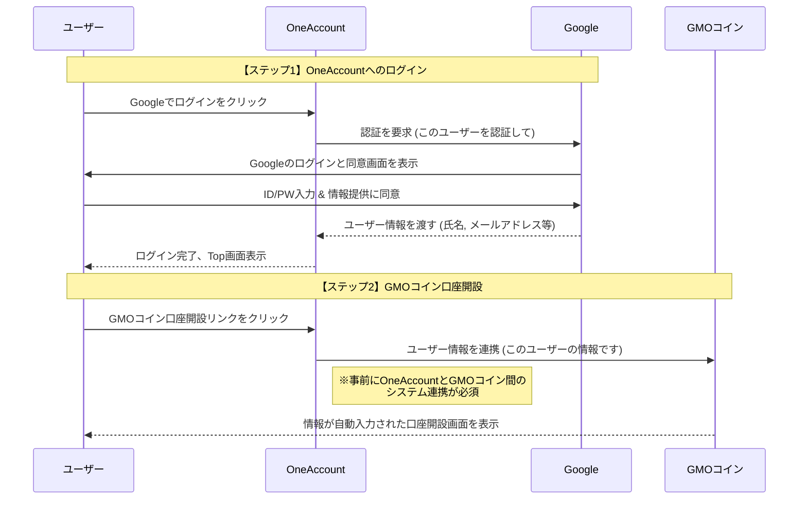
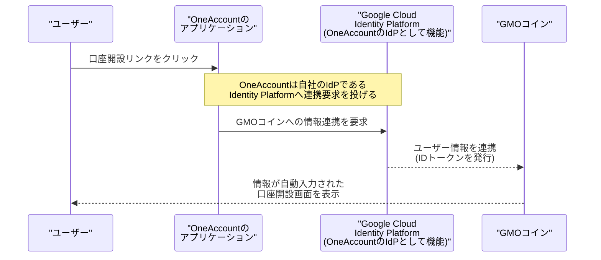
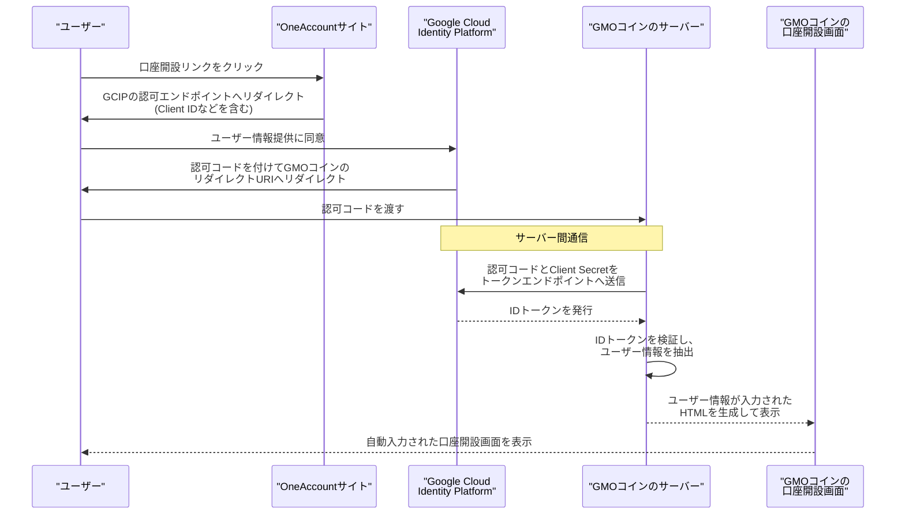

## 想定しているフロー
1. ユーザがOneAccountのサイトでGoogleでログインする
2. Googleでログインが正常に終了し、ユーザがOneAccountサイトのTop画面に遷移する
3. Top画面に表示されている、グループ内証券会社（GMOコイン社）の口座開設リンクをクリックする
4. ユーザのブラウザにGMOコイン社の口座開設申し込み画面が表示される。

## AIに質問したいこと
4の時点で、ユーザの氏名やメールアドレスなどGoogleに登録されている情報を口座開設画面に自動入力することは可能？

----
## AIからの回答
提示されたフローにおいて、Googleログインで取得したユーザー情報をGMOコインの口座開設画面に自動入力することは、**技術的に可能**です。

ただし、これを実現するためには、**OneAccountとGMOコイン社との間で、事前にシステム的な連携が構築されている**必要があります。ユーザーが個別に設定して実現できるものではありません。

以下に、その仕組みと実現のための条件を解説します。

### 自動入力が実現する仕組み

これは「ID連携」や「シングルサインオン（SSO）」と呼ばれる技術領域の話となります。一般的には、**OpenID Connect (OIDC)** という標準技術を用いて実現されます。

情報の流れを順を追って説明すると、以下のようになります。

1.  **【ステップ1】 OneAccountがGoogleから情報を取得**

      * ユーザーがOneAccountのサイトで「Googleでログイン」を選択すると、OneAccountはGoogleに対して認証を要求します。
      * ユーザーはGoogleの画面でログインし、「OneAccountがあなたの氏名、メールアドレスなどの情報にアクセスすることを許可しますか？」といった内容の同意画面で「許可」します。
      * 同意に基づき、Googleはユーザー情報（氏名、メールアドレスなど）を暗号化された安全な形でOneAccountに提供します。
      * この時点で、OneAccountはユーザーのGoogleアカウント情報を保持している状態になります。

2.  **【ステップ2】 OneAccountからGMOコインへ情報を連携**

      * ユーザーがOneAccountサイト上の「GMOコインの口座開設」リンクをクリックします。
      * このリンクには、OneAccountがGMOコインに対して「このユーザーの情報を連携します」ということを示す、特殊な情報が含まれています。
      * OneAccountとGMOコインの間でシステム連携が組まれていれば、OneAccountはステップ1でGoogleから取得したユーザー情報を、安全な形でGMOコインに引き渡します。
          * （多くの場合、ここでも「OneAccountがGMOコインにあなたの情報を提供することを許可しますか？」といった、ユーザーの明確な同意を求める画面が一度表示されます。）
      * 情報を受け取ったGMOコインは、その情報を自社の口座開設申し込みフォームの氏名やメールアドレスの欄に自動的に入力（初期表示）します。

### フローの図解



### 結論

ご質問の「ユーザの氏名やメールアドレスなどGoogleに登録されている情報を口座開設画面に自動入力することは可能か？」という点については、

**回答：はい、可能です。**

ただし、それはOneAccountとGMOコインという**サービス提供者同士が、ユーザー情報の連携についてシステム的な提携を結んでいる場合に限られます。** ユーザー体験を向上させるための一般的な機能であり、多くのサービスで採用されています。


----
----
## AIへの質問
```
OneAccountとGMOコイン社との間で、事前にシステム的な連携が構築されている必要があります
```
これ具体的に何をどうする？

## AIの回答
### ステップ1：契約・合意形成（ビジネス・法務）

まず技術的な実装の前に、両社間でビジネス上および法務上の合意を形成します。

* **提携の合意:** なぜID連携を行うのか、お互いのメリットは何か、といったビジネス上の目的を共有し、業務提携契約などを結びます。
* **個人情報の取り扱いに関する合意:**
    * **連携する情報の範囲:** 口座開設に必要な情報のうち、どの項目（例：氏名、メールアドレス、住所、生年月日など）を連携対象とするかを厳密に定義します。
    * **利用目的の明確化:** 連携した個人情報をGMOコインが「口座開設手続きのためだけ」に利用することを明確にします。
    * **セキュリティ要件の合意:** 情報漏洩などが起きないよう、お互いが遵守すべきセキュリティ基準（通信の暗号化方式など）について合意します。
    * **法的遵守:** 個人情報保護法などの法律を遵守した連携方法であることを確認します。
* **秘密保持契約（NDA）の締結:** これから共有する技術情報などを外部に漏らさないための契約を結びます。

---

### ステップ2：技術仕様の決定（エンジニア）

契約・合意内容に基づき、エンジニアが連携システムの具体的な設計図を決めます。

* **連携プロトコルの選定:**
    * どのような技術標準で安全に情報をやり取りするかを決めます。現在、最も一般的に使われるのは**OpenID Connect (OIDC)** という規格です。
    * この場合、**OneAccountがIdP（Identity Provider: IDを提供する側）**、**GMOコインがRP（Relying Party: IDを利用する側）** という役割分担になります。

* **API仕様の定義:**
    * **エンドポイントの決定:** OneAccountは、GMOコインが情報を要求するためにアクセスするURL（APIエンドポイント）を準備し、そのURLをGMOコインに伝えます。
    * **連携データのフォーマット定義:** 連携する情報（氏名など）をどのような形式（例: JSON）で渡すか、各データ項目名をどうするか（例: `email`, `given_name`）などを細かく決めます。
    * **認証・認可フローの決定:** ユーザーの同意取得画面をどちらが表示するか、どのような手順でトークン（認証情報）を交換するかなど、詳細な処理フローを決定します。

---

### ステップ3：実装・設定（エンジニア）

決定した技術仕様に基づき、両社のエンジニアがそれぞれのシステムに開発（実装）と設定作業を行います。

#### 【OneAccount側（情報を渡す側）が行うこと】

1.  **IdP（IDプロバイダー）機能の実装:**
    * GMOコインからの情報連携リクエストを受け付け、ユーザーの同意に基づき、暗号化されたユーザー情報（**IDトークン**）を発行するシステムを構築します。

2.  **クライアント（GMOコイン）の登録:**
    * 自社のIdPシステムに、連携先であるGMOコインを「信頼できるクライアント」として正式に登録します。
    * この際、GMOコインを識別するためのIDとパスワードのようなもの（`クライアントID` と `クライアントシークレット`）を発行し、GMOコインに安全な方法で伝えます。
    * GMOコインのどのURLからの要求を許可するか（`リダイレクトURI`）を登録し、不正なサイトからのなりすましを防ぎます。

#### 【GMOコイン側（情報を受け取る側）が行うこと】

1.  **RP（リライングパーティ）機能の実装:**
    * OneAccountに情報連携をリクエストし、受け取ったIDトークンを処理するシステムを構築します。

2.  **IdP（OneAccount）の登録:**
    * 自社のシステムに、連携元であるOneAccountを「信頼できるIdP」として登録します。
    * OneAccountから受け取った`クライアントID`と`クライアントシークレット`を設定します。
    * OneAccountのAPIエンドポイントのURLを設定します。

3.  **IDトークンの検証ロジックの実装:**
    * 受け取ったIDトークンが、本当にOneAccountから発行されたもので、途中で改ざんされていないかを検証する仕組みを実装します。これはセキュリティ上、極めて重要な処理です。

4.  **フォームへの自動入力機能の実装:**
    * 検証済みのIDトークンの中からユーザー情報（氏名、メールアドレスなど）を正しく抽出し、口座開設フォームの対応する項目に自動でセットする機能を実装します。

### まとめ

「システム的な連携」とは、単にパソコンを設定するような簡単なものではなく、**両社の法務・ビジネス・技術の各チームが連携して進める、契約から設計、開発、テストまでを含む一連のプロジェクト**を指します。

ユーザーがボタン一つでサービス間を安全かつ便利に移動できる裏側では、こうした緻密な準備が行われているのです。

-----
-----
## AIへの質問
これ、Googleの何かのサービスを使用したら、実装の工数減ったりする？
`IdP（IDプロバイダー）機能の実装`ってフルスクラッチで作らないといけないのかな？

## AIからの回答
素晴らしいご質問です。結論から言うと、

**はい、Googleのサービスを使えば、IdP機能の実装工数を劇的に削減できます。フルスクラッチで開発する必要はほとんどありません。**

そのために利用するのが、**Google Cloud Identity Platform** というサービスです。

-----

### Google Cloud Identity Platformとは？

これは、Googleが提供する **「認証機能をサービスとして利用できる」プラットフォーム（IDaaS: Identity as a Service）** です。

本来、IdPを自社で開発（フルスクラッチ）しようとすると、以下のような非常に多くのことを考慮・実装する必要があり、膨大なコストと時間がかかります。

  * **安全なデータベース設計:** ユーザーのパスワードなど機密情報をどう安全に保管するか。
  * **認証プロトコルの実装:** OpenID ConnectやSAMLといった複雑な技術仕様を正確に実装する。
  * **セキュリティ対策:** 不正アクセス、アカウント乗っ取り、DoS攻撃などからどうシステムを守るか。
  * **スケーラビリティ:** 将来ユーザーが増えたときに、サーバーが処理しきれるように設計する。
  * **各種ライブラリの管理:** 認証に使うライブラリの脆弱性管理やアップデート対応。

**Google Cloud Identity Platform**は、これら「認証の専門的で面倒な部分」をすべてGoogleが肩代わりしてくれるサービスです。

### 具体的にどう工数を削減できるか

OneAccount社は、フルスクラッチでIdPを開発する代わりに、**Google Cloud Identity Platformを「自社のIdP」として利用**します。

具体的には、以下のようになります。

1.  **IdP機能の実装が不要になる:**

      * OneAccountはGoogle Cloudの管理画面でIdentity Platformを有効にし、いくつかの設定を行うだけで、高機能で安全なIdPを持つことができます。プログラミングによる開発は最小限で済みます。

2.  **GMOコイン社の登録が簡単になる:**

      * 前回の説明の「ステップ3」にあった「クライアント（GMOコイン）の登録」は、Google Cloudの管理画面上で行います。
      * GMOコインの情報をいくつか入力するだけで、連携に必要な`クライアントID`や`クライアントシークレット`が自動で発行されます。

3.  **高いセキュリティと信頼性を享受できる:**

      * Googleが長年培ってきた認証・セキュリティ技術（多要素認証、不正検知など）をそのまま利用できるため、自社で開発するよりもはるかに安全なシステムを構築できます。

### 処理の流れのイメージ

Google Cloud Identity Platformを利用した場合の処理の流れは以下のようになります。



※この図では、ユーザーがOneAccountにログイン済みであることを前提としています。

### 補足：Firebase Authenticationとの関係

検索結果にも出てきた**Firebase Authentication**も、中身はGoogle Cloud Identity Platformと同じ技術基盤です。主にモバイルアプリやWebアプリの開発者向けに、より手軽に使えるようにパッケージングされたものです。プロジェクトの要件に応じて、どちらかを選択することになりますが、どちらを使ってもIdPを自前で構築する手間を大幅に省けることに変わりはありません。

### まとめ

  * **IdPはフルスクラッチで開発する必要はない。**
  * **Google Cloud Identity Platform** を利用することで、開発工数を大幅に削減しつつ、Google水準の安全でスケーラブルな認証連携基盤を迅速に構築できる。

これは、現代のWebサービス開発における定石ともいえるアプローチです。

-----
-----
## AIへの質問
Google Cloud Identity Platformを使用した場合、OneAccountとGMOコインはそれぞれどのような実装を行う必要がある？

## AIからの回答
### 【OneAccount側】の実装・設定作業

**役割：IdP (Identity Provider) の設定・管理**

OneAccount社が行う作業は、主に**Google Cloudの管理コンソール上での設定**が中心となります。プログラミング作業は比較的少ないです。

1.  **GCIPでGMOコインを「クライアント」として登録する**

      * Google CloudプロジェクトでIdentity Platformを有効化します。
      * 管理画面の「IDプロバイダ」や「クライアント」といったセクションで、連携先であるGMOコインを「**OpenID Connect (OIDC) プロバイダ**」のクライアントとして新規登録します。
      * この設定画面で、以下の情報を入力・取得します。
          * **入力する情報：**
              * **承認済みのリダイレクトURI:** GMOコインから事前に教えてもらう必要があります。GCIPがユーザー情報を渡した後に、ユーザーを安全に戻すためのGMOコイン側のURLです。（例: `https://gmo-coin.com/callback/oneaccount`）セキュリティ上、完全に一致するURLしか許可されません。
          * **自動で発行・生成される情報：**
              * **クライアントID (Client ID):** 連携するクライアント（GMOコイン）を識別するためのID。
              * **クライアントシークレット (Client Secret):** クライアントが本物であることを証明するためのパスワードのような秘密情報。

2.  **GMOコインに連携情報を安全に提供する**

      * 上記ステップで発行された「**クライアントID**」と「**クライアントシークレット**」を、GMOコインの開発担当者に安全な方法（パスワード付きファイルなど）で伝えます。
      * 加えて、GCIPが提供する以下の**エンドポイントURL**もGMOコインに伝えます。これらはGCIPの管理画面に表示されています。
          * 認可エンドポイント (Authorization Endpoint)
          * トークンエンドポイント (Token Endpoint)
          * ユーザー情報エンドポイント (UserInfo Endpoint)

3.  **OneAccountサイトのリンクを実装する**

      * OneAccountサイトに設置する「GMOコイン 口座開設」のリンク先URLを、ただの固定URLではなく、**動的に生成**するように実装します。
      * このリンクは、GCIPの**認可エンドポイント**を指す必要があり、URLのクエリパラメータに以下の情報を含めます。
          * `response_type=code` （認可コードを要求する、という宣言）
          * `client_id=` （GMOコインのクライアントID）
          * `redirect_uri=` （登録済みのGMOコインのURI）
          * `scope=openid profile email` （氏名やメールアドレスの情報提供を要求する、という宣言）
          * その他、セキュリティのためのパラメータ（`state`, `nonce`）

-----

### 【GMOコイン側】の実装作業

**役割：RP (Relying Party) の実装**

GMOコイン側は、OneAccount (GCIP) からユーザー情報を受け取るための**バックエンド処理の実装**が中心となります。**OIDC認定ライブラリ**を利用するのが一般的で、これにより実装は大幅に簡略化されます。

1.  **OneAccount (GCIP) の情報をシステムに設定する**

      * OneAccountから提供された「クライアントID」「クライアントシークレット」「各種エンドポイントURL」を、自社のシステムのコンフィグファイルや環境変数に設定します。

2.  **リダイレクトURIに対応する処理を実装する**

      * OneAccountに伝えたリダイレクトURI (`/callback/oneaccount`など) に対応するバックエンド処理を実装します。この処理は、ユーザーがGCIPでの同意を終えた後に最初に呼び出されます。
      * この処理は、GCIPから渡される「**認可コード (Authorization Code)**」を受け取ります。

3.  **認可コードをIDトークンと交換する (サーバー間通信)**

      * 受け取った「認可コード」を使い、GMOコインの**サーバーから**GCIPの**トークンエンドポイント**に対してAPIリクエストを送信します。
      * このリクエストには、認可コード、自社のクライアントID、クライアントシークレットを含めます。
      * この通信はユーザーのブラウザを介さない、サーバー同士の直接通信なので安全です。

4.  **IDトークンを検証し、ユーザー情報を取得する**

      * GCIPから**IDトークン**が返却されます。IDトークンはJWT (JSON Web Token) という形式の暗号化された文字列です。
      * **【最重要】** 受け取ったIDトークンが、**本物のGCIPから発行され、改ざんされていないこと**を、OIDCライブラリを使って厳密に検証します。
      * 検証後、IDトークンの中からユーザー情報（氏名、メールアドレスなど）を安全に抽出します。

5.  **口座開設フォームに情報を自動入力する**

      * 抽出したユーザー情報を、口座開設フォームの各項目にセットした状態でHTMLを生成し、ユーザーのブラウザに表示します。

### 全体の処理フロー図



このように、GCIPのようなIDaaSを利用することで、両社は認証連携の複雑な仕様を自前で開発することなく、標準的なプロトコルに沿った設定と実装に集中することができます。