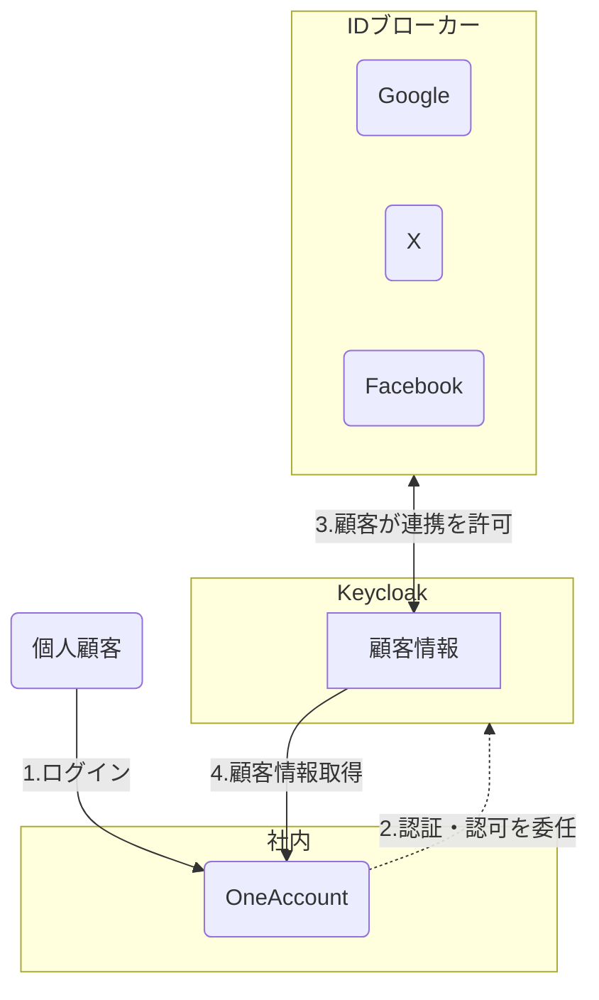
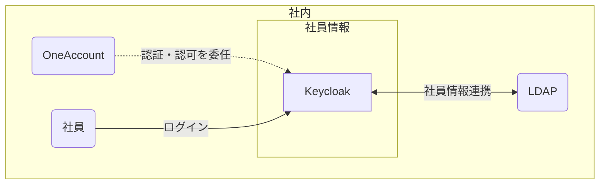

### 認証基盤としてのKeycloak活用とソーシャルログイン連携に関する調査報告**

**1. はじめに**
オープンソースのID・アクセス管理ソリューション「Keycloak」について調査しましたので、その主な機能と活用方法についての共有です。

**2. Keycloakとは**
Keycloakは、アプリケーションから認証・認可の機能を分離し、一元的に管理するための専門サーバーです。これにより、各アプリケーションは認証に関する複雑な実装を持つ必要がなくなります。

**3. 主要機能：IDブローカリングによるソーシャルログイン連携**
Keycloakの強力な機能の一つに「IDブローカリング」があります。

* **概要:** Keycloakが「認証のハブ」として機能し、Google、Facebook、その他SAML/OIDCに対応した外部の認証サービス（IDプロバイダー）を仲介します。
* **効果:** この機能を利用することで、私たちのアプリケーションはKeycloakとだけ通信すればよくなり、Googleなど個別のサービスAPIと直接連携する必要がなくなります。

**4. 想定される認証フロー**
Keycloakを導入した場合、ユーザーのログインフローは以下のようになります。

1.  **ログイン開始:** ユーザーが自社サイトの「ログイン」ボタンをクリックします。
2.  **Keycloakへ遷移:** サイトはユーザーをKeycloakが提供するログイン画面にリダイレクトさせます。
3.  **認証方法の選択:** ユーザーはKeycloakの画面上で、「ID/パスワード入力」または「Googleでログイン」などのボタンを選択します。
4.  **外部サービスでの認証:** 「Googleでログイン」が選択された場合、ユーザーはGoogleのページで認証を行います。
5.  **ログイン完了:** 認証成功後、Keycloakはユーザーを自社サイトに安全にコールバック（リダイレクト）し、ログインが完了します。

**5. Keycloakによるユーザー情報の一元管理**
Keycloakは、様々な方法で取得したユーザー情報を自身のデータベースで一元管理します。

* **ユーザー情報の主な取得元:**
    1.  **直接登録:** Keycloakの登録フォームからユーザーが自身で登録。
    2.  **管理者による作成:** 管理者が手動でユーザーを作成。
    3.  **IDブローカリング:** Google等の外部サービスでの認証時に情報を取得（今回の主要テーマ）。
    4.  **ユーザーフェデレーション:** LDAP等の既存ユーザーデータベースと連携。

* **ソーシャルログイン時の挙動:**
    * **初回ログイン時:** ユーザーが初めて「Googleでログイン」すると、KeycloakはGoogleから連携された情報（氏名、メールアドレス等）を元に、**自身のデータベース内に新しいユーザーを自動で作成**し、そのGoogleアカウントと紐付けます。
    * **2回目以降:** 同じユーザーがログインすると、Keycloakは紐付け情報から既存ユーザーだと認識し、ログインを許可します（必要に応じて最新情報に更新）。

これにより、ユーザーがどの方法で登録・ログインしても、アプリケーションからは「Keycloakのユーザー」として一貫して扱うことが可能になります。

**6. Keycloak導入によるメリット**

* **(1) 実装の簡素化と関心の分離:** アプリケーションは認証処理の複雑さから解放されます。
* **(2) 高い拡張性と柔軟性:** 将来的にFacebookログインやSAML認証を追加する際も、Keycloak側の設定で対応可能です。
* **(3) ユーザー管理の一元化:** 上記5の通り、ログイン方法によらず、全ユーザーをKeycloak上で統合管理できます。
* **(4) セキュリティの集約と向上:** 認証という重要なセキュリティ要件を、専門ソフトウェアであるKeycloakに集約できます。

**7. 補足：認証に使われるトークンについて**
ログイン成功時、Keycloakは標準的なプロトコル（OIDC）に基づき、主に2種類のトークンを発行します。

* **IDトークン:** ユーザーが誰であるかを示す「身分証明書」。ユーザー情報（名前、メールアドレス等）が含まれます。
* **アクセストークン:** ユーザーが何をして良いか（権限）を示す「通行許可証」。保護されたAPIへのアクセス時に利用します。

**8.イメージ**
### 顧客情報の連携

### 社員情報の連携
