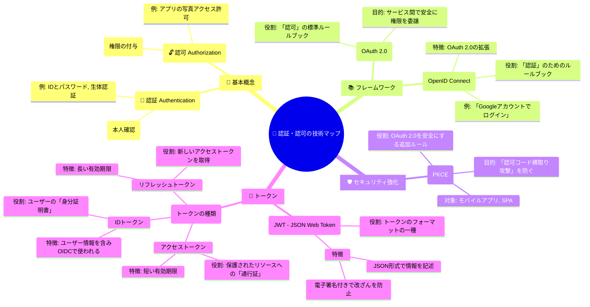

```mermaid
mindmap
  root((👑 認証・認可の技術マップ))
    id1[🔑 基本概念]
      id1.1(👤 認証 Authentication)
        一言でいうと: 「あなたは誰？」 (本人確認)
        例: IDとパスワード, 生体認証
      id1.2(🔓 認可 Authorization)
        一言でいうと: 「あなたに何を許可する？」 (権限の付与)
        例: アプリの写真アクセス許可
        
    id2[📚 フレームワーク]
      id2.1(OAuth 2.0)
        役割: 「認可」の標準ルールブック
        目的: サービス間で安全に権限を委譲
      id2.2(OpenID Connect)
        役割: 「認証」のためのルールブック
        特徴: OAuth 2.0の拡張
        例: 「Googleアカウントでログイン」
        
    id3[🛡️ セキュリティ強化]
      id3.1(PKCE)
        役割: OAuth 2.0を安全にする追加ルール
        目的: 「認可コード横取り攻撃」を防ぐ
        対象: モバイルアプリ, SPA
        
    id4[🎫 トークン]
      id4.1(JWT - JSON Web Token)
        役割: トークンのフォーマットの一種
        特徴
          JSON形式で情報を記述
          電子署名付きで改ざんを防止
      id4.2(トークンの種類)
        アクセストークン
          役割: 保護されたリソースへの「通行証」
          特徴: 短い有効期限
        リフレッシュトークン
          役割: 新しいアクセストークンを取得
          特徴: 長い有効期限
        IDトークン
          役割: ユーザーの「身分証明書」
          特徴: ユーザー情報を含みOIDCで使われる
```